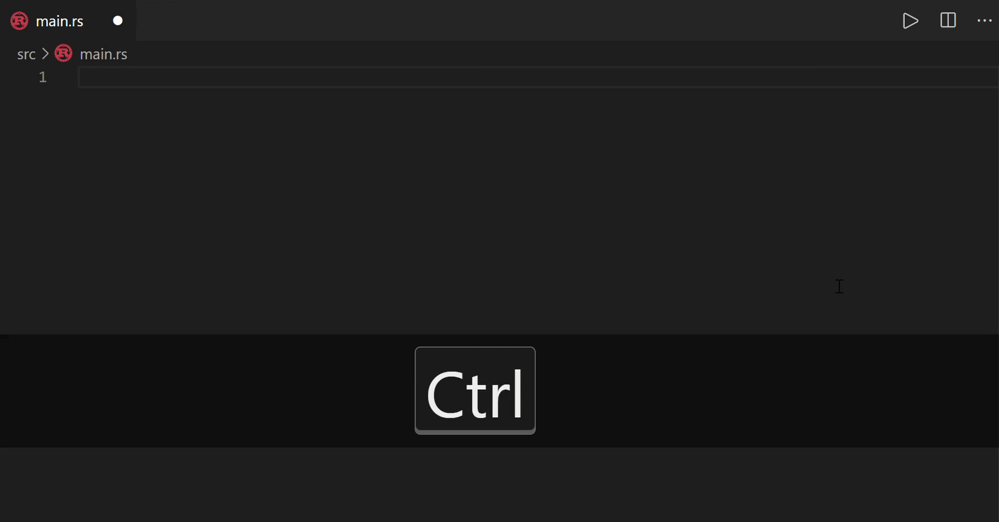

# codesnip-vscode

Insert the constructed snippet without duplication for Rust.



Install codesnip.
```
cargo install codesnip
```

Set your library root files to `Codesnip: Source` and reload window.

For more information, visit [codesnip](https://github.com/to-omer/codesnip).
